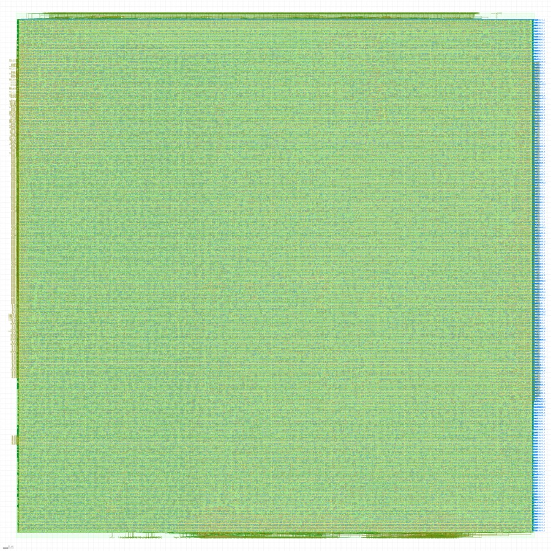

# P4 result: the first completed GDS

`sonic_router`, Sky130 HD, LibreLane, one x86-64 box. Finished 2026-08-28
20:08:48 UTC after **4 h 40 min**, all 80 stages passed.



Artifacts committed under `openlane/router/results/segs8/`: `metrics.json`,
`metrics.csv`, `manufacturability.rpt`, `cell_function.rpt`,
`step-runtimes.txt`, and the render above. The 113 MB GDS itself is not
vendored — `metrics.json` is the deliverable, the GDS is what you look at.

## Configuration actually run

`config.json` in this repo now matches the run that finished, which is **not**
the config it shipped with:

| Knob | Was | Ran | Why |
|---|---|---|---|
| `ROUTER_PWL_SEGS` | 64 | **8** | the actual ABC fix — see below |
| `LANES` | 16 | **4** | runtime, not tractability |
| `CLOCK_PERIOD` | 10 ns | **1500 ns** | measured, see below |

## Headline metrics

| Metric | Value |
|---|---|
| Die area | 1,022,290 µm² |
| Core area | 987,359 µm² |
| Utilisation | 59.98% |
| Cell count | 224,588 (104,366 std cells + 120,222 fill) |
| Setup/hold WNS & TNS, all 9 corners | 0 |
| Routed wirelength | 2,709,735 µm over 51,098 nets |
| Vias | 490,935 (all single-cut) |
| Antenna violations | 0 (503 → 0 after repair; 29 diodes) |
| Magic DRC / KLayout DRC | 0 / 0 |
| Magic-vs-KLayout GDS XOR | 0 |
| LVS errors | 0 |
| Worst IR drop | 79.7 mV (4.4% of 1.8 V) |
| Total power | 2.67 W (1.59 switching, 1.09 internal) |

Manufacturability: Antenna ✅ · LVS ✅ · DRC ✅.

## The arc

1. **`ROUTER_PWL_SEGS=64` blew up ABC.** 2+ hours of single-threaded technology
   mapping with no convergence. The suspicion was the multiplier array; it was
   not. Pre-ABC, the SEGS=64 netlist reports **5,120 flops and 100% of its area
   sequential** — 64 segments × 2 coefficients × 32 bits is 4,096 registers,
   plus the 64-way 32-bit segment mux over them. The table, not `LANES`, is the
   hot spot. SEGS=8 cleared it.
2. **Post-CTS timing repair then exposed the real problem.** WNS **-1086.6 ns**
   at a 10 ns clock: the top-k network's critical path was ~1097 ns, over 100×
   the period. Resizing cannot close that — it fixes drive strength, not logic
   depth — so `repair_timing` ground at ~0.14 ns/iteration. Raising
   `CLOCK_PERIOD` to 1500 ns unblocked the flow; it models nothing.
3. **The root cause got fixed in RTL** (commit `0b7539a`): the serial
   max-extract top-k (2,518 combinational levels, one E-1-deep dependent chain
   per pass) became a tournament tree — 461 levels, same comparator count,
   7.6% fewer cells. Confirmed in this run by `[INFO RSZ-0098] No setup
   violations found`.
4. **Clean from there**: antenna repair 503/687 → 0/0, routing DRC 150 → 0 over
   12 iterations, zero XOR difference between the Magic and KLayout GDS.

## Where the 4 h 40 min went

| Step | Wall |
|---|---|
| `06-yosys-synthesis` | 2:00:09 |
| `45-openroad-detailedrouting` | 0:51:15 |
| `37-openroad-resizertimingpostcts` | 0:42:44 |
| `56-openroad-stapostpnr` | 0:15:58 |
| `66-klayout-drc` / `65-magic-drc` | 0:09:32 / 0:09:10 |
| everything else | minutes or less |

Synthesis and the post-CTS resizer are 59% of the run on their own, and both are
the two structures this block already knows about: ABC on the PWL table, and the
resizer on the top-k cone.

## The caveat, not swept under the rug

Timing signoff (WNS/TNS) and physical signoff (DRC/LVS/antenna) are clean. The
**electrical-limit** checks are not:

| Check | Violations (worst corner) |
|---|---|
| Max slew | 42,310 (`max_ss_100C_1v60`) |
| Max cap | 208 |
| Max fanout | 3,105 (identical across all 9 corners) |

Max fanout being corner-invariant says it is structural, not electrical: nets
driving more loads than the library's limit allows, which the clock net's 1,586
terminals (flagged as a warning by the tool) and the 40,260 inserted
antenna/diode cells both feed. These are real and would have to be fixed for a
tapeout; they are not what the WNS=0 headline is measuring, and quoting the
headline without them would be dishonest.

## SEGS=64: answered, negatively

The follow-on experiment re-ran SEGS=64 with the tournament-tree RTL in place,
to test whether the earlier ABC non-convergence was really the top-k depth. It
burned **~11 hours of CPU in ABC** and never converged. It is not the top-k.
Finding 1 above stands: 4,096 table registers behind a 64-way mux is its own
blowup, independent of the top-k cone.

### What that bought, back in P2

"SEGS=64 does not synthesise" was taken as a tool problem for two runs. It is a
design problem, and P2 has now answered it twice over:

1. **The table needed 64 segments only because it spanned the wrong range.**
   The router's logits sit inside about ±4; the table spanned [-8, 8). Sweeping
   both axes against the 8.47 B checkpoint (`make p2-pwl-sweep`) shows halving
   the range is worth exactly one doubling of the segment count — **32 segments
   over ±4 gives the same 0.9961 routing agreement as 64 over ±8**. Half the
   flops, half the mux, no accuracy paid. That is now the default in
   `sonic_defs.svh`. (This is finding 20's lesson from the FFN's SiLU, applied
   to the router's sigmoid for the first time.)
2. **The read is now registered.** After the pipelining work, `memory_map`
   reports `Extracted data FF from read port 0` for both tables — the SEGS-way
   mux now terminates in a flop instead of feeding a 32×32 multiply and then the
   top-k cone. Yosys still maps the array to flops -- nothing in this flow's
   config points it at a memory macro -- so the flop count is unchanged; what
   changed is that the mux is no longer on a path 461 levels long.

The remaining ask is unchanged in kind: a firmware-loadable coefficient table
should be a small sync-read RAM, not 2,048 flip-flops behind a 32-way mux. On a
real 14 nm flow with a memory compiler that is a macro instantiation.

**Correction to what this file used to say here.** It claimed Sky130 has no SRAM
macro to map to, and treated that as a limitation of the validation vehicle. That
is not right, and it matters because it was being used to defer P2-12 (see
`ROADMAP.md`) indefinitely. Sky130 has no *memory compiler*, which is the true
part; but it does have a family of pre-hardened OpenRAM macros --
`sky130_sram_1kbyte_1rw1r_32x256_8`, `sky130_sram_2kbyte_1rw1r_32x512_8` and
relatives -- which are what Caravel-based designs instantiate, and which
LibreLane consumes through `MACROS` plus the matching LEF/LIB/GDS. The router's
table is 2,048 x 32 bits at SEGS=32, which the 2 kbyte part covers directly.

So P2-12 is a piece of work, not a blocked one. What it costs is a config with
macro placement and a PDN that reaches over the macro, which is a real step up
in flow complexity from a pure standard-cell run -- but it is available on the
PDK already in use, and it is the single change that most reduces this block's
flop count. **This has not been tried yet: verify the macro set is present in
the PDK on the build box before planning around it.**

## What this run already says about the clock

`CLOCK_PERIOD = 1500` models nothing, as stated above -- but the completed run
still measured a critical path, because worst *slack* is reported per corner and
the period is known. `1500 - slack` is the longest path the router actually has:

| Corner | Worst setup slack | Longest path |
|---|---:|---:|
| `ff_n40C_1v95` | 1121.1 ns | 378.9 ns |
| `tt_025C_1v80` | 1074.4 ns | 425.6 ns |
| `ss_100C_1v60` | **933.0 ns** | **567.0 ns** |

So the pipelined router closes at roughly **1.76 MHz** on Sky130 HD at SEGS=8 --
and that is with the resizer given 1500 ns of slack and therefore no reason to
try. A properly constrained run should do better than 567 ns; this is an upper
bound, not an estimate.

Two things follow, both of which were previously open:

1. **P4-2 does not need a discovery run.** `config-next.json` can be constrained
   directly. It now carries `CLOCK_PERIOD = 800`: comfortably above the 567 ns
   measured at SEGS=8, with room for the wider read mux that SEGS=32 adds, and
   1.9x tighter than 1500, so `repair_timing` has to engage and report rather
   than exiting immediately. If it closes at 800, tighten again.
2. **Sky130 is not the vehicle for the frequency claim, and this quantifies how
   far off it is.** 1 GHz is 1,700x this number. That gap is process, not
   design -- 130 nm standard cells against a 14 nm target -- but it means no
   f_max claim in this program can cite this run, in either direction.

## Tooling note

The apt `klayout` (0.26.2) segfaults running a `.py` macro — it appears to hand
`.py` files to its Ruby interpreter. Use a current build; the one that worked
was KLayout 0.30.7 from nixpkgs:

```
klayout -z -nc -r p4/render_gds.py -rd gds=... -rd out=... -rd size=4000
```
